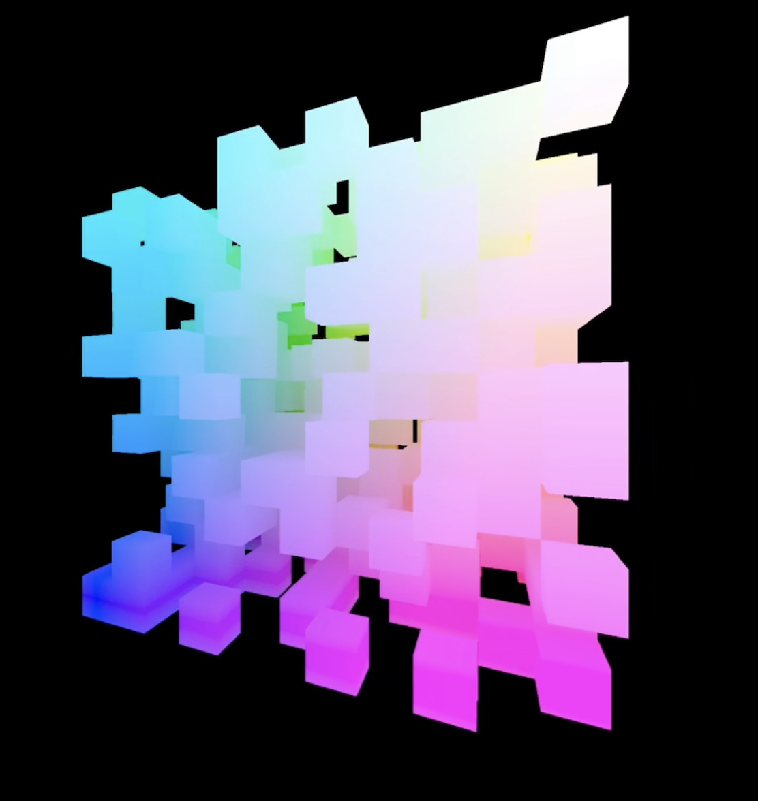

# Voxel test
Simple test for learning rust/opengl

  
  

## Table of contents
* [General info](#general-info)
* [Stats](#stats)

## Stats
- Version: `1.0.0`

## General info
- [x] Rotation
- [x] Simple random generation
- [x] Colors depending on position

## Contributing
Pull requests are welcome.   
For major changes, please open an issue first to discuss what you would like to change.

